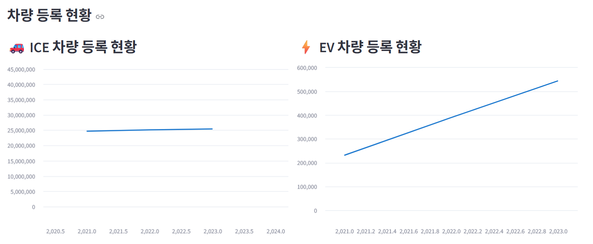
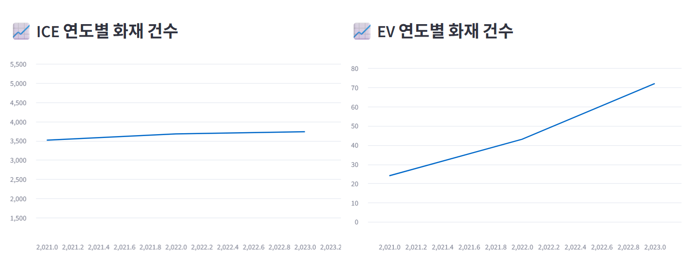
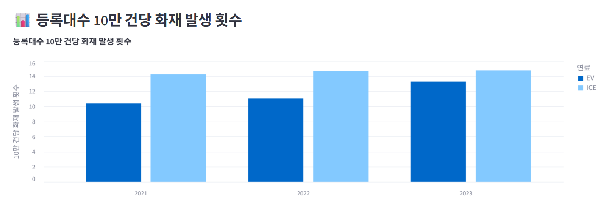

# 전기차 화재 발생률 분석 및 배터리 안전 FAQ

## 1. 팀 소개

| 강지완 | 마한성 | 이상민 | 임상민 |
|:--:|:--:|:--:|:--:|
|  |  |  |  |

---

## 2. 프로젝트 소개

📎 **프로젝트 명** : 전기차와 내연기관차 화재 발생률 비교 및 배터리 안전 FAQ 조회 서비스
📅 **기간** : 2025/09/03-2025/09/04
🎯 **목적** : 전기차 화재 안전성에 대한 객관적 데이터 제시 및 불안감 해소  
📖 **레퍼런스** : 국토교통부, 소방청 화재 통계 / 기아자동차, 테슬라, 쉐보레 EV FAQ

---

## 📎 프로젝트 내용

- **전기차 vs 내연기관차 화재 발생률 비교**
  - 2021-2023년 동안의 차량 등록 대비 화재 발생률 분석
  

- **정부 지침 및 기업별 지침 FAQ**
  - 전기차 배터리 안전 관련 정부 지침(충돌, 침수, 열폭주 시험 등)
  - 주요 완성차 기업(현대, 기아, 테슬라 등)의 배터리 관리 방침
  - 사용자 FAQ(충전 습관, 배터리 관리 방법 등)

- **시각화 및 탐색 기능**
  - 연도별 전체 차량 및 전기차 화재 발생률 추이 그래프
  - FAQ 검색/조회 기능

---

## 🔍 화재 발생률 비교

| 구분        | 전기차 (EV) | 내연기관차 (ICE) |
|-------------|-------------|------------------|
| 10만 대당 화재 건수 | 13.2건 | 14.7건 |
| 주요 원인   | 배터리 열폭주, 충전 이상 | 연료 누출, 엔진 과열 |
| 비고        | 발생률 낮으나 진압 어려움 | 발생률 높으나 진압 용이 |

> ※ 실제 수치는 기관 보고서를 참고하여 업데이트 예정  

---

## ❓ 배터리 안전 FAQ
- 기업별 FAQ 접근
  - 기아 EV
  - 쉐보레 
  - 테슬라

### 🏛 정부 지침
- **Q. 전기차 배터리 안전 기준은 무엇인가요?**  
  A. 충돌·침수·열폭주 시험을 통과해야 하며, 재사용·재활용 기준도 마련되어 있습니다.  

- **Q. 충전기 설치 관련 규제는 있나요?**  
  A. 급속 충전기는 전기설비 안전 기준을 준수해야 하며, 정기 점검이 의무화되어 있습니다.  

### 🏭 기업별 지침
- **Q. 기업들은 배터리 안전을 어떻게 관리하나요?**  
  A. 배터리 관리 시스템(BMS)을 통해 과충전/과방전 시 자동 차단 기능을 제공합니다.  

- **Q. 결함이나 리콜이 발생하면 어떻게 되나요?**  
  A. 기업은 리콜 체계를 통해 정부와 협력하여 리콜 및 교체를 시행합니다.  

- **Q. 사용자가 지켜야 할 관리 수칙은 무엇인가요?**  
  A. 과충전·과방전 피하기, 고온 장시간 주차 자제, 비인증 충전기 사용 금지 등입니다.  

---

## 3. 기술 스택 🛠
- Python (데이터 처리 및 시각화)
  > Pandas, Altair
- Streamlit (인터페이스)
- MySQL (데이터베이스)
- DA# Modeler5 (ERD)
- Selenium (FAQ 크롤링)

---

## 4. WBS 🛠

---

## 5. 요구사항 명세서 🛠

---

## 6. ERD 🛠

---

## 🔍 수집 데이터
- **소방청** : 차량 화재 통계
- **국토교통부/한국전력공사** : 전기차 보급 현황 및 전기차 제조사/차량 목록
- **기업 FAQ** : 현대·기아·테슬라 공식 FAQ 페이지 크롤링

---

## 7. 실행결과 🛠

---

## 8. 개발과정 이슈 및 해결 💡
- 데이터 소스별 정의 불일치 → 전처리 과정에서 기준 단일화
- 화재 발생률 표본 수 부족 → 소방청 브리핑 자료 및 해당 자료를 참고한 언론 보도 활용
- FAQ 크롤링 차단 이슈 → Selenium 및 User-Agent 헤더 추가로 해결

---

## 9. 회고 🖊
- **강지완**
> 데이터를 활용하는 과제에 있어서 주제 선정이 얼마나 중요한지를 깨달을 수 있었습니다. 주제가 커버할 수 있는 범위가 좁아질 수록, 데이터를 수집하기 어려워지고 원하는 데이터를 얻기 힘들어진다는 것을 깨닫게 되었습니다. 기존 데이터 수집 방법으로는 csv 파일 탐색 및 API 요청 위주였습니다. 이번 기회에 정적 크롤링, 동적 크롤링 기법 모두 사용하면서 데이터 수집에 대한 자신감을 얻게 되었습니다. 프로젝트 초기 진행 단계의 중요성 또한 깨닫게 되었습니다. 팀 프로젝트의 경험이 부족했기 때문에 업무 분담 및 개발 환경 통일, Git 저장소 및 브랜치 관리 등에 있어 부족함이 있음을 알게 되었습니다. 이후의 프로젝트를 진행할 때는 지금의 경험을 교훈삼아 더 체계적인 과정을 진행할 수 있도록 노력하겠습니다.
- **마한성**
> 이번 프로젝트에서는 사전 조사 부족으로 인한 데이터 부족 문제로 중간에 주제 변경을 고려해야 하는 상황이 발생했으며, 향후 프로젝트에서는 구체적인 목표 설정보다는 큰 방향만 정해두고 데이터 수집을 먼저 꼼꼼히 진행하여 실현 가능한 범위에서 주제를 확정하는 것이 중요하다는 교훈을 얻었습니다. 또한 크롤링 지식 부족으로 Tesla FAQ 접근이 차단되고, 텍스트 중간의 이미지나 표 구조 처리에 어려움을 겪으면서 기본적인 크롤링 기법 외에도 다양한 웹 구조에 대응할 수 있는 크롤링 기술의 필요성을 실감했습니다. 이러한 경험을 통해 데이터 중심의 프로젝트 설계 방식과 다양한 크롤링 상황에 대한 대응 능력을 다음 프로젝트의 핵심 개선사항으로 설정하게 되었습니다.
- **이상민**
> SKN 부트캠프를 시작하고 얼마 안 지나서 진행한 프로젝트라 걱정이 정말 많았었는데 좋은 팀원 분들과 의논해가면서 진행하는 과정이 한편으로는 프로그래밍에 재미를 붙일 수 있는 기회가 되어준 것 같습니다. 프로젝트 진행에 크게 문제는 없었지만, 주제가 ‘자동차’라는 주제 안에서 너무 깊게 들어가버린 감이 없지 않아 있어서 전 기수 분들의 프로젝트랑 대비했을 때 데이터의 양이 다소 적어보인다는 느낌이 들었습니다. 또한 대학교 재학 중에 간단하게 배웠던 크롤링을 이제서야 실전으로 구현해보았는데, selenium, requests, BeautifulSoup 등의 라이브러리를 사용하는 과정이 이론으로 배울 때만큼 쉽지는 않다는걸 뼈아프게 느끼게 되었습니다. 이러한 점들을 바탕으로 다음 프로젝트부터는 프로그래밍을 본격적으로 시작하기 전에 보다 확실하게 데이터를 확인하는 등 확실하게 계획을 짜야할 것 같습니다.
- **임상민**
> 수업 시간에 배운 크롤링 기법을 직접 적용하여 실제 데이터를 수집하면서 배운 내용을 터득할 수 있었다. 데이터를 정리하고 문서화하는 과정에서 정보 구조화의 중요성을 느꼈다. Streamlit을 통해 분석 결과를 시각적으로 표현하며, 코드가 눈에 보이는 결과물로 변하는 경험이 새로웠다. 짧은 기간 안에 여러 도구와 개념을 연결해보며 부족한 부분과 보완할 점도 명확히 알게 되었다. 앞으로는 더 효율적인 코드 작성과 깔끔한 시각화를 통해 프로젝트 완성도를 높이고 싶다.

---

## 10. 참고 자료 📄
- [국토교통부 자동차 등록 통계](https://www.molit.go.kr)  
- [소방청 화재 통계](https://www.nfa.go.kr)  
- [IEA Global EV Outlook](https://www.iea.org/reports/global-ev-outlook)  
- 현대자동차·기아·테슬라 FAQ 공식 페이지  

---

## 📜 라이선스
본 프로젝트는 MIT License 하에 배포됩니다.
